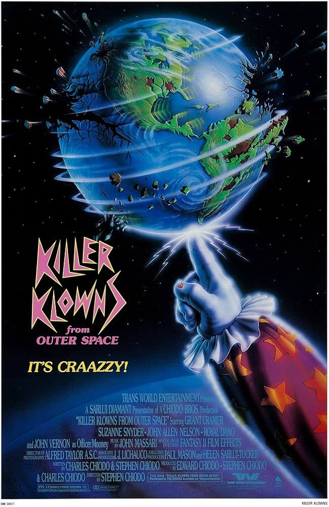
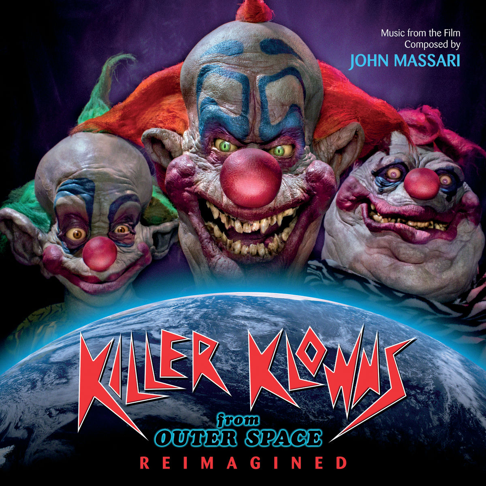
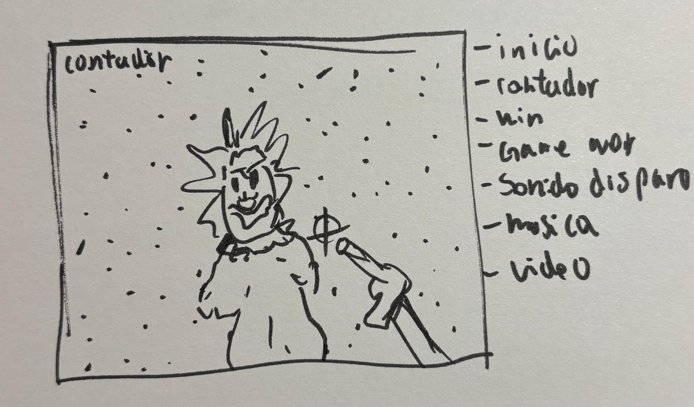
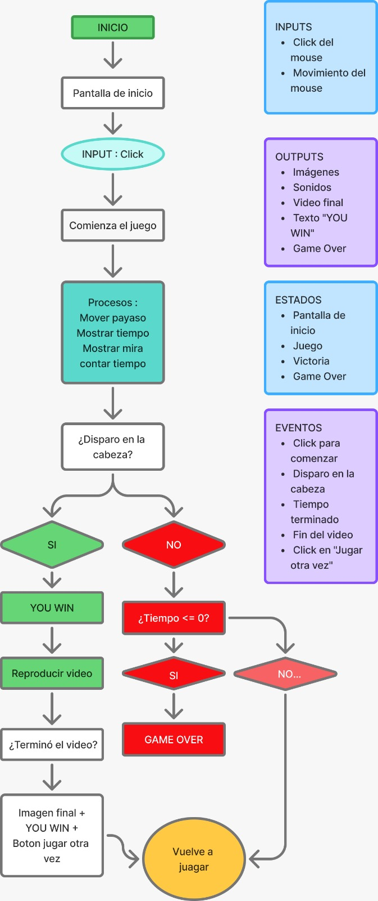

# Kill the clown!
## Escena / Juego interactivo inspirado en la pelicula Killer Klowns From Outer Space (1988)
## Autor: Rocio Acuña Sanchez

.png)

Este mini juego interactivo desarrollado en p5.js donde el jugador debe eliminar a un payaso extraterrestre antes de que se acabe el tiempo (20 segundos).
El objetivo es dispararle únicamente en la cabeza mientras el personaje se mueve constantemente por la pantalla.

El proyecto utiliza imágenes, sonido y video para crear una experiencia inmersiva inspirada en el diseño de videojuegos de terror y supervivencia

**¿Qué se ve en pantalla?**
- Pantalla de inicio.
- Fondo del juego.
- Payaso en movimiento.
- Mira controlada por el mouse.
- Temporizador.
- Pantalla de Game Over.
- Video de victoria.
- Pantalla final con "YOU WIN".
  
**Elementos visuales**
- Imagen de inicio.
- Imagen de fondo.
- Imagen del payaso.
- Imagen de mira.
- Estrellas animadas.
- Texto animado.
- Video final.

**Inputs**
- Movimiento del mouse.
- Click izquierdo del mouse.
  
**Outputs**
 Movimiento del payaso.
- Movimiento de la mira.
- Sonidos.
- Video de victoria.
- Cambio entre pantallas.
- Temporizador.
(La mayoria de las imagenes las saque de videos de youtube)
 [link]https://www.youtube.com/watch?v=p-eGJlvw7r8
**Descripción conceptual :**
Crear una experiencia donde el jugador deba reaccionar rápidamente para eliminar un objetivo antes de que termine el tiempo, utilizando una estética inspirada en el terror y los videojuegos arcade.

**Corriente o referente :**
Diseño de videojuegos.

**Referentes visuales :**
Juegos arcade.
Juegos de terror.
Estética de circos oscuros.
Interfaces minimalistas de videojuegos.

**Principio de diseño explorado :**
Interactividad mediante estados, retroalimentación audiovisual y respuesta inmediata a las acciones del usuario.

## Sistema computacional ##

**Inputs**
- Posición del mouse.
- Click del mouse.
- Tiempo transcurrido.

**Procesos**
- Movimiento del payaso.
- Detección de impactos.
- Cálculo del tiempo.
- Reproducción de sonidos.
- Reproducción del video.
- Cambio entre estados.

**Estados**
- Pantalla de inicio.
- Juego.
- Pantalla de victoria.
- Pantalla de derrota.

**Eventos**
- Click para comenzar.
- Disparo.
- Impacto en la cabeza.
- Fin del tiempo.
- Fin del video.
- Botón "Jugar de nuevo".

**Outputs**
- Cambio de imágenes.
- Animaciones.
- Sonidos.
- Video.
- Mensajes de victoria y derrota.

## Explicación de la interacción ##
El usuario inicia el juego con un clic en cualquier parte de la pantalla.
Luego controla una mira utilizando el mouse y debe disparar únicamente a la cabeza del payaso antes de que el temporizador llegue a cero.
Si acierta, se reproduce un video de victoria y posteriormente aparece la pantalla final con un mensaje de "YOU WIN".
Si el tiempo termina antes de lograr el objetivo, aparece la pantalla de "GAME OVER".

## Recursos multimedia ##

### Imágenes

[Pantalla inicio](imagenes/Captura%20de%20pantalla%20(118).png)

[Fondo](imagenes/Captura%20de%20pantalla%20(126).png)

[Payaso](imagenes/payaso.png)

[Mira](imagenes/mira-Photoroom.png)

[Fondo final](imagenes/ganar.webp)

- Pantalla de inicio.
- Fondo del juego.
- Fondo de victoria.
- Payaso.
- Mira.

Función:
Construyen la identidad visual del juego.

### Audios
- [Música de fondo](audio/cancion2.mp3)
- [Sonido de disparo](audio/disparo.mp3)

Música de fondo.
Sonido del disparo.

Función:
Entregar retroalimentación auditiva e incrementar la tensión.

**Video**

Animación de victoria.

Función:
Recompensar al jugador cuando gana.

## Registro visual ##
**Referentes**

**Boceto principal**
este dibujo lo hice la clase antes el examen solo para no olvidaarme de lo que queria.

**Capturas del proceso**

.png)

.png)
estos errores los logre solucionar con la ia de chatgpt.

## Codigos que mas me cuestan entender aun
for (let i = 0; i < 120; i++) {

Significa:
let i = 0; → crea una variable llamada i y empieza en 0.
i < 120; → mientras i sea menor que 120, el código se seguirá repitiendo.
i++ → al terminar cada repetición, i aumenta en 1.
Entonces el código se ejecuta 120 veces.

 // Crear el video de ganar
  videoWin = createVideo(["ganar.mp4"]);

if (videoWin) {
  videoWin.size(width, height);
  videoWin.position(0, 0);
  
  // oculta el video hasta que el jugador gane
  videoWin.hide();
  videoWin.volume(1); 
  
  //Detecta cuándo finaliza el video para ejecutar otras acciones
  videoWin.onended(function(){
    
  // oculta el video después de reproducirse
  videoWin.hide();

  // Cambia el estado del programa para indicar que el video terminó y mostrar la pantalla final
  finVideo = true;
    
//Cierra la función que se ejecuta cuando termina el video.
});
}
}

Este bloque configura el video. Primero le da el tamaño de la pantalla, lo posiciona, lo mantiene oculto y define su volumen. Luego, cuando el jugador gana, el video se reproduce. Al terminar, el programa lo oculta y cambia el estado mediante la variable finVideo para mostrar la pantalla final con el mensaje 'YOU WIN'

if (clownX > width - 120 || clownX < 120) {
    speedX *= -1;
}
¿Qué hace?

Comprueba si el payaso llegó al borde izquierdo o derecho.

width - 120 → borde derecho.
120 → borde izquierdo.
|| significa "o".

Si ocurre cualquiera de las dos condiciones:

speedX *= -1;

cambia el signo de la velocidad.

Ejemplo:

18 → -18

-18 → 18

Así el payaso rebota.

if (millis() - tiempoInicio < 3000) {
¿Qué hace?

Comprueba si han pasado menos de 3000 milisegundos, es decir, 3 segundos, desde que comenzó el juego.

Mientras eso sea verdadero, se muestra el mensaje de ayuda.

tiempoRestante = 20 - floor((millis() - tiempoInicio) / 1000);
¿Qué hace?

Calcula cuánto tiempo queda.

millis() → dice cuántos milisegundos han pasado desde que empezó el programa.
tiempoInicio → guarda el momento en que comenzó el juego.
millis() - tiempoInicio → calcula cuánto tiempo ha pasado desde que empezó el juego.
/1000 → convierte milisegundos a segundos.
floor() → elimina los decimales.
20 - ... → resta esos segundos a los 20 segundos iniciales.

Por eso el contador baja de 20 → 19 → 18... hasta llegar a 0.

let tam = 80 + sin(frameCount * 0.15) * 10;
¿Qué hace?

Crea una variable llamada tam que hace que el texto cambie de tamaño continuamente.

80 → tamaño normal.
sin() → hace el movimiento suave.
frameCount → cuenta los fotogramas.
*10 → cuánto aumenta y disminuye.

## Reflexión final ##

Durante el desarrollo aprendí a utilizar variables, funciones, estados, eventos, multimedia y estructuras propias de p5.js para construir un sistema interactivo más complejo
Mi principal dificultad fue integrar correctamente el video con los distintos estados del juego y coordinar la interacción entre imágenes, sonidos y temporizador
Este proyecto me permitió comprender mejor cómo organizar un programa utilizando funciones y cómo construir una experiencia interactiva completa,
Aunque aun me cuestan entender principalmente cuando hay muchos valores.
Y quede con las ganas de poner el video final de game over del payaso riendose :(

## Diagrama

[link](https://www.figma.com/board/9w5QpXXgch7jRdzYTNAs45/Sin-t%C3%ADtulo?node-id=0-1&p=f&t=QUes9udHOnNf3MFr-0)

## Enlaces ##

**Proyecto p5.js (ejecutable):**

[link](https://editor.p5js.org/rocio.acuna/full/ELc6Pxo-L)

**Código editable:**

[link](https://editor.p5js.org/rocio.acuna/sketches/ELc6Pxo-L)

Repositorio GitHub:

[link](https://github.com/rocioacuna-svg/Examen-Pensamiento-Computacional)
